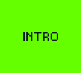
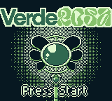
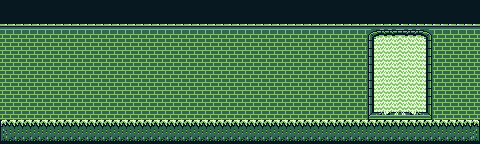
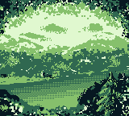
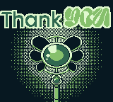

# VerdeRosa (GB Studio Project)

**VerdeRosa** is a Game Boy video game developed in **GB Studio**.

This project was created for the exhibition **VerdeRosa** by artist **Emmanuel Con Dos Emmes**, presented at **Paper Caper Co** in **South Padre Island, Texas** on **April 3, 2026**.

## Project Description

VerdeRosa is a narrative-focused experience that follows **Vero**, a girl in despair and loneliness who has been trapped in the **green side**.

A mysterious entity named **Xolotl** appears to guide her toward the **pink side**, where everything transforms into its true self.

The game is primarily a **visual novel** with short gameplay segments that involve pressing buttons in specific sequences. A full playthrough lasts about **10 minutes**.

## Built With

- [GB Studio](https://www.gbstudio.dev/)
- Game Boy-compatible pixel art and scene scripting

## Screens / Artwork

Below are selected background images from `assets/backgrounds`:

### Intro

### Cover / Press Start

### Green Side Mood

### Pink Side

### Thank You Screen

## Repository Structure

- `VerdeRosa-GBC.gbsproj` – GB Studio project file
- `project/` – scene/event data and game flow resources
- `assets/` – visual, audio, and UI assets used by the game

## Credits

- **Artist / Creator:** Emmanuel Con Dos Emmes
- **Exhibition:** VerdeRosa
- **Venue:** Paper Caper Co, South Padre Island, Texas
- **Date:** April 3, 2026
